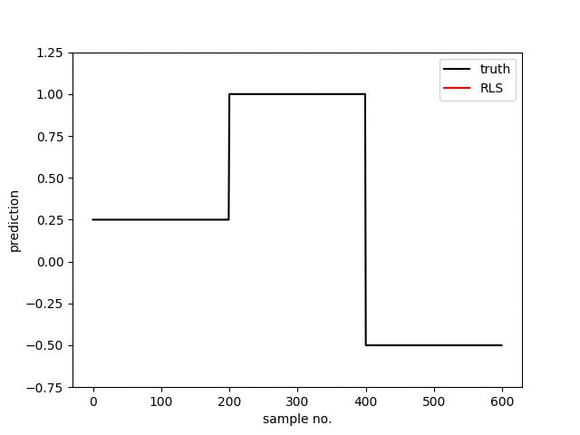

# adaptive-filters
My collection of implementations of adaptive filters.

 

#### Recursive Least Squares
Recursive least squares (RLS) is an adaptive filter algorithm that recursively finds the coefficients that minimize a weighted linear least squares cost function relating to the input signals. This approach is in contrast to other algorithms such as the least mean squares (LMS) that aim to reduce the mean square error.

#### Partial Least Squares
Partial least squares regression is an extension of the multiple linear regression model. The alogithm projects the features into a new set of features in a lower‐dimensional space. Each such “latent feature” is a linear combination of the original features. Regression done using the latent variables guarantees that the principal components, which “explain” X optimally, will be relevant for the prediction of Y. Fo this, PLS incorporates information from Y to choose the projection that describes the covariation of data X and labels Y.

#### Moving Window Least Squares
The moving window least squares algorithm is another popular adaptive parameter estimation technique. The model parameters are estimated again when a given number, s (step size), of new data samples have been collected. The number of samples used for model training is w, the window size. The length of the window signifies the size of the database that is used for parameter estimation, and the step size signifies the frequency of the estimation.

#### Recursive Locally Weighted Partial Least Squares [[paper]](https://doi.org/10.1016/j.chemolab.2014.04.007)
This modification of PLS adjusts to the process changes by merging the RLS in the just-in-time(JIT) framework. The algorithm is used to address both time varying and non-linearity issues simultaneously under the JIT framework. While building the local PLS model, a moving window approach is adopted to update the database. Two weighting matrices WT and WS are formulated to account for time varying and non-linearity issues.

#### Online Passive Aggressive Algorithm [[paper]](http://www.jmlr.org/papers/v7/crammer06a)
This an adaptive parameter tracking algorithm from the machine-learning literature. The parameter update occurs only when the prediction deviates from the target by more than the threshold. OPAA minimizes the absolute value of the prediction error for the latest sample.

#### Kalman Filter
Kalman filtering is an algorithm that uses a series of measurements observed over time, containing statistical noise and other inaccuracies, and produces estimates of unknown variables that tend to be more accurate than those based on a single measurement alone, by estimating a joint probability distribution over the variables for each timeframe.