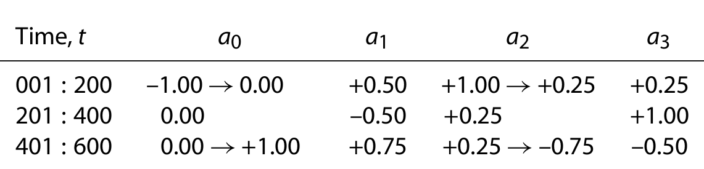

A single input–single output parameter varying ARX model is simulated as follows:

Here the input  is a uniformly distributed random number in the interval , , , , and  are the ARX model parameters, and  is zero mean white noise. For the training set, a total of 600 samples are generated, and the ARX parameters are varied with a combination of ramp and step changes as shown in the table.

The least squares solution for the first 20 points is used as the initial value of the ARX parameters. Finally, outliers are added to the output to observe how the different algorithms perform in the presence of extreme values.